# BÁO CÁO ĐỒ ÁN KIỂM THỬ PHẦN MỀM

## KIỂM THỬ WEBSITE THƯƠNG MẠI ĐIỆN TỬ - SHOESHOP

### Thành viên

| MSSV | Họ và tên |
| --- | --- |
| 3122411189 | Đỗ Phú Thành |
| 3122411088 | Huỳnh Duy Khang |
| 3122411024 | Võ Thành Danh |
| 3122411167 | Huỳnh Minh Quân |

**Giảng viên hướng dẫn:** TS. Đỗ Như Tài

## Cài đặt môi trường

**1. Clone repository**

```
git clone https://github.com/danhdct122c3/sgu25_dct122c3_ktpm
```

**2. Chạy website bằng Docker **

```cmd

docker compose build backend frontend


docker compose build


docker compose up -d
```


### 1. Giới thiệu phần mềm

### 1.1. Tổng quan dự án

 Nhóm thực hiện kiểm thử dự án ShoeShop Store. Thông qua việc thiết kế và thực thi kịch bản kiểm thử toàn diện,
  đề tài đảm bảo tính ổn định và chất lượng phần mềm tối ưu trước khi đưa vào sử dụng

### 1.2. Công nghệ sử dụng

| Danh mục       | Tools / Frameworks                                          |
| -------------- |-------------------------------------------------------------|
| Frontend       | Vite, ReactJS, TypeScript                                   |
| Backend        | Spring Boot, Maven                                          |
| Database       | MySQL                                                       |
| Authentication | Spring Security, JWT                                        |
| Testing        | JUnit, Mockito, Spring Boot Test, MockMvc, H2, Selenium, K6 |
| CI/CD          | GitHub Actions                                              |
| Deployment     | Vercel deploy Frontend ,render Backend                        |

<!-- html -->
<table>
  <tr>
    <td align="center" width="140">
      
      <div style="font-size:12px;color:#444;margin-top:6px">Backend</div>
    </td>

    <td align="center" width="140">
      <!-- React explicitly constrained to 48x48 to avoid oversized SVG whitespace -->
      
      <div style="font-size:12px;color:#444;margin-top:6px">Frontend</div>
    </td>

    <td align="center" width="140">
      
      <div style="font-size:12px;color:#444;margin-top:6px">CI / Git</div>
    </td>

    <td align="center" width="180">
      
      
      <div style="font-size:12px;color:#444;margin-top:6px">Deploy</div>
    </td>

    <td align="center" width="200">
      
      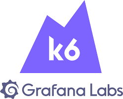
      
      <div style="font-size:12px;color:#444;margin-top:6px">Test</div>
    </td>
  </tr>
</table>


### 1.3. Thiết kế phần mềm


###  Quy trình nghiệp vụ

**Quy trình kiểm soát truy cập**

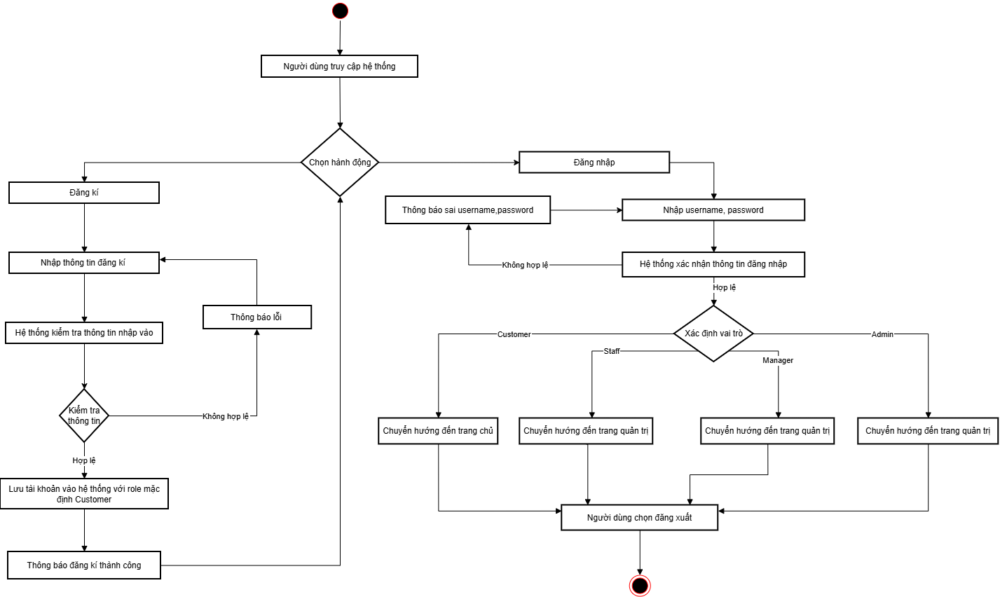

**Quy trình quản lý đơn hàng**

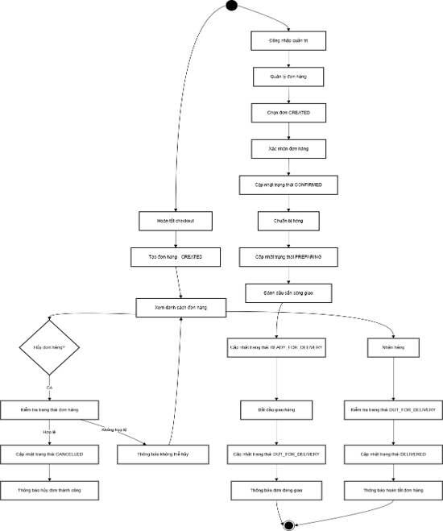

**Quy trình mua hàng**

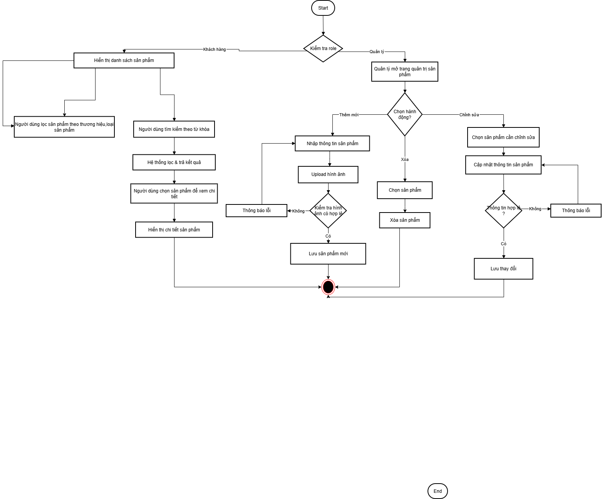

**Quy trình quản lý người dùng**

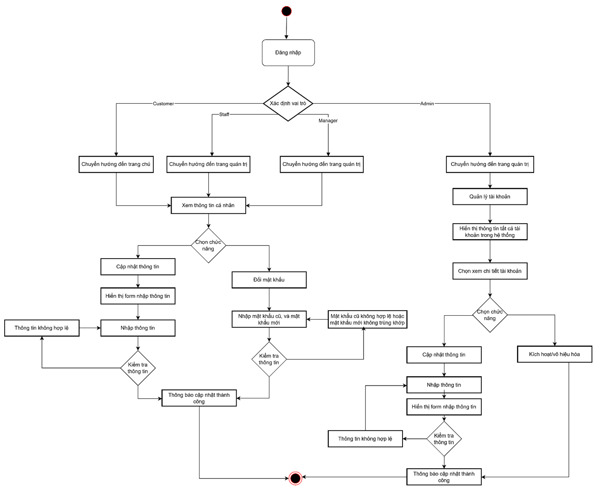

### 1.3.3. Use case


**UC1 Danh mục sản phẩm**

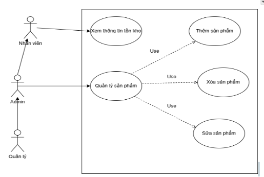

**UC2 Quản lý giỏ hàng**


**UC3 Quản lý đơn hàng**

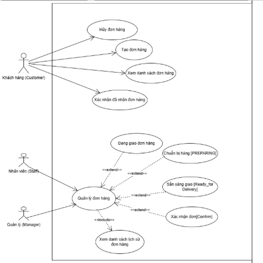


**UC4 Kiểm soát truy cập**

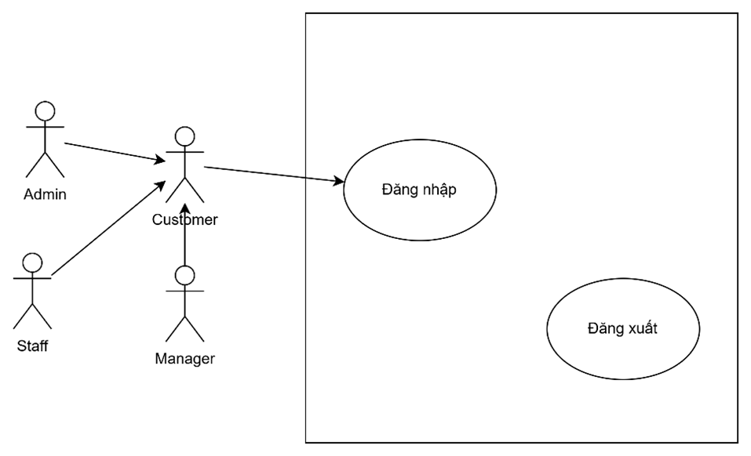


**Mô hình khái niệm**

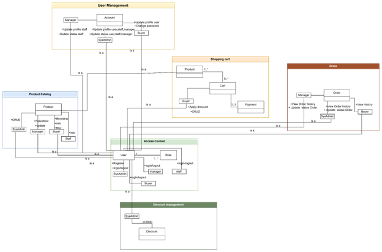

### 1.3.5. Data model

**Mô hình thực thể kết hợp mức khái niệm**

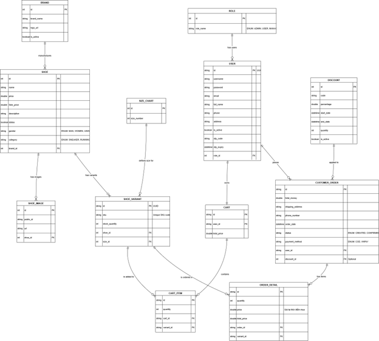

**Mô hình thực thể kết hợp mức logic**


**Mô hình thực thể kết hợp mức vật lý**

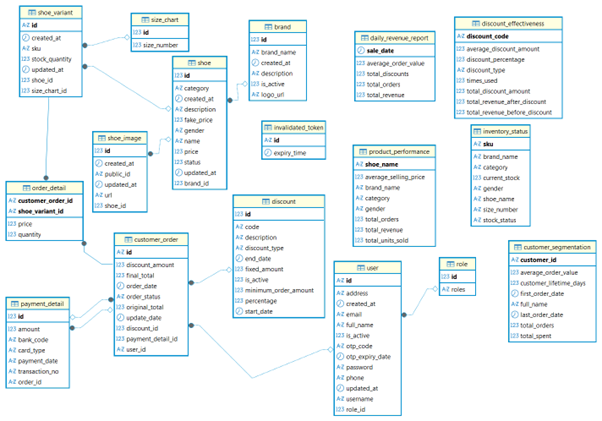

### 1.4. Thiết kế kiến trúc

### 1.4.1. Sơ đồ khối

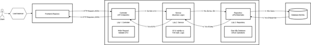

### 1.4.2. Kiến trúc C4

**C1 - System context**

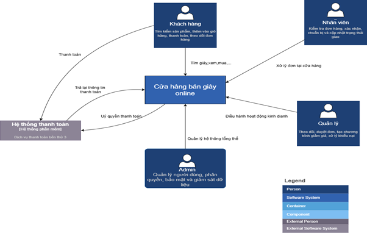

**C2 – Container**

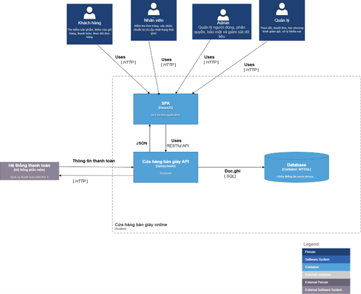

**C3 – Component (high-level)**

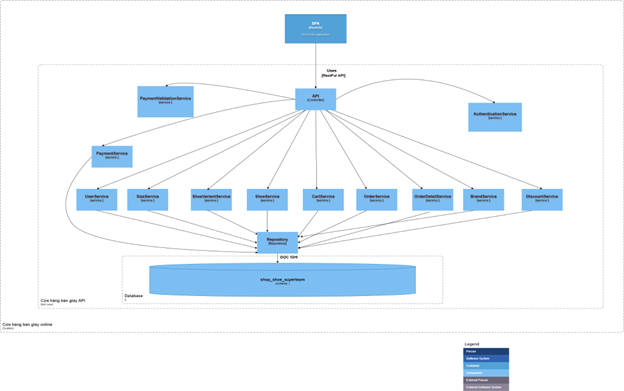


**Sơ đồ sequence**

**Quản lý sản phẩm**

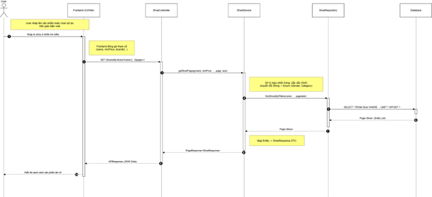

**Quản lý giỏ hàng**

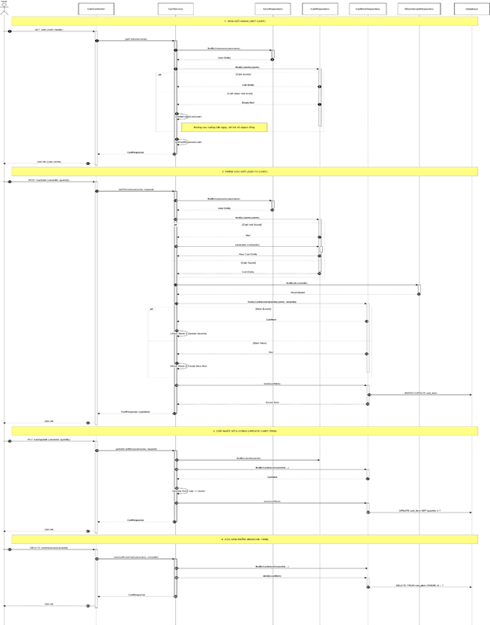


**Quản lý đơn hàng**

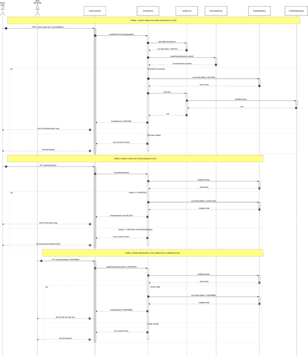


## 2. Kế hoạch kiểm thử

### 2.1. Hạng mục được kiểm thử

### 2.1.1. Chức năng

**Kiểm soát truy cập**

- Xác minh rằng hệ thống cho phép đăng nhập cho chức vụ là khách hàng, quản trị viên.

- Xác minh rằng hệ thống cho phép đăng ký tài khoản cho khách hàng.

- Xác minh rằng hệ thống cho phép đăng xuất đối với tất cả người dùng đã đăng nhập.

- Xác minh rằng hệ thống thực thi phân quyền truy cập đúng, chỉ cho phép người dùng truy cập các chức năng phù hợp với vai trò của mình.

- Xác minh rằng hệ thống cho phép quản trị viên thực hiện quản lý người dùng với các thao tác CRUD.

**Danh mục sản phẩm**

- Xác minh rằng hệ thống hiển thị danh sách sản phẩm với đầy đủ thông tin chi tiết: tên, mô tả, giá bán, thương hiệu, kích cỡ và trạng thái tồn kho.

– Xác minh rằng hệ thống cho phép khách hàng thực hiện tìm kiếm sản phẩm theo từ khóa, lọc theo danh mục/thương hiệu và sắp xếp theo giá/tên.

– Xác minh rằng hệ thống hiển thị chính xác hình ảnh và thông tin chi tiết khi người dùng chọn xem một sản phẩm cụ thể.

– Xác minh rằng hệ thống cho phép Quản lý thực hiện các thao tác thêm mới, chỉnh sửa, xóa (hoặc ẩn) sản phẩm và cập nhật tồn kho.

– Xác minh rằng hệ thống hiển thị thông báo lỗi phù hợp khi nhập dữ liệu sản phẩm không hợp lệ (ví dụ: giá âm, thiếu tên).


**Giỏ hàng & Thanh toán **

- Xác minh rằng hệ thống cho phép Quản lý tạo mới mã giảm giá với các tham số: mức giảm (tiền/phần trăm), ngày hiệu lực, giới hạn số lượng.

- Xác minh rằng hệ thống cho phép chỉnh sửa hoặc vô hiệu hóa mã giảm giá đang hoạt động.

- Xác minh rằng hệ thống áp dụng đúng mức giảm giá cho đơn hàng đủ điều kiện và ngăn chặn việc áp dụng cho đơn hàng không đủ điều kiện.


**Quản lý đơn hàng**

– Xác minh rằng hệ thống cho phép khách hàng hoàn tất đặt hàng (checkout) với đầy đủ thông tin giao nhận và phương thức thanh toán (COD/VNPay).

– Xác minh rằng hệ thống xử lý giao dịch thanh toán trực tuyến chính xác và cập nhật trạng thái đơn hàng tương ứng.

– Xác minh rằng hệ thống cho phép khách hàng xem lại lịch sử đơn hàng và chi tiết trạng thái xử lý của từng đơn.

– Xác minh rằng hệ thống chỉ cho phép khách hàng hủy đơn hàng khi đơn đang ở trạng thái hợp lệ (Created/Confirmed).

– Xác minh rằng hệ thống cho phép Nhân viên/Quản lý cập nhật trạng thái đơn hàng theo đúng quy trình nghiệp vụ (Confirmed → Preparing → Delivery → Delivered).

– Xác minh rằng hệ thống tự động trừ số lượng tồn kho khi đơn hàng được xác nhận và hoàn lại tồn kho nếu đơn hàng bị hủy.

**Quản lý mã giảm giá **

– Xác minh rằng hệ thống cho phép Quản lý tạo mới mã giảm giá với các tham số: mức giảm (tiền/phần trăm), ngày hiệu lực, giới hạn số lượ

– Xác minh rằng hệ thống cho phép chỉnh sửa hoặc vô hiệu hóa mã giảm giá đang hoạt động.

– Xác minh rằng hệ thống áp dụng đúng mức giảm giá cho đơn hàng đủ điều kiện và ngăn chặn việc áp dụng cho đơn hàng không đủ điều kiện.

**Quản lý người dùng**

– Xác minh rằng hệ thống cho phép khách hàng tự cập nhật thông tin hồ sơ cá nhân (Họ tên, địa chỉ, số điện thoại) và thay đổi mật khẩu.

– Xác minh rằng hệ thống cho phép Admin xem danh sách toàn bộ người dùng và tìm kiếm tài khoản theo tiêu chí.

– Xác minh rằng hệ thống cho phép Admin thực hiện khóa (disable) hoặc mở khóa (ena

### 2.1.2. Khả năng sử dụng
Xác minh rằng hệ thống cung cấp thanh điều hướng rõ ràng, cho phép người dùng truy cập các trang chính như trang chủ, danh sách sản phẩm, giỏ hàng và đơn hàng.
Xác minh rằng người dùng có thể dễ dàng quay lại trang trước hoặc trang chủ trong quá trình sử dụng.
Xác minh rằng các nút chức năng chính được hiển thị rõ ràng và dễ thao tác


### 2.1.3. Tương thích
Xác minh rằng hệ thống cung cấp thanh điều hướng rõ ràng, cho phép người dùng truy cập các trang chính như trang chủ, danh sách sản phẩm, giỏ hàng và đơn hàng.
Xác minh rằng người dùng có thể dễ dàng quay lại trang trước hoặc trang chủ trong quá trình sử dụng.
Xác minh rằng các nút chức năng chính được hiển thị rõ ràng và dễ thao tác


### 2.1.4. Giao diện
Xác minh rằng các màu sắc, font chữ và kiểu hiển thị đúng theo thiết kế.
Xác minh rằng logo, hình ảnh, icon được hiển thị đúng vị trí và không bị biến dạng.
Xác minh rằng các thông báo lỗi, cảnh báo, hoặc thông tin trạng thái hiển thị đúng theo ngữ cảnh nghiệp vụ.


### 2.1.5. Hiệu năng

Xác minh rằng hệ thống đáp ứng nhanh khi tải bình thường.
Xác minh rằng hệ thống vẫn hoạt động ổn định khi có nhiều người dùng truy cập đồng thời (load testing).
Xác minh rằng hệ thống có thể chịu được tải cực đại mà không bị crash (stress testing).


### 2.1.6. API

Xác minh rằng các endpoint API hoạt động đúng chức năng theo thiết kế.
Xác minh rằng dữ liệu trả về từ API chính xác, đầy đủ và tuân theo định dạng yêu cầu.
Xác minh rằng quyền truy cập và bảo mật của các API được đảm bảo, người dùng không được phép truy cập trái phép.
Xác minh rằng các API tương tác đúng với cơ sở dữ liệu, giao diện UI và các endpoint liên quan khác.
Xác minh rằng các luồng nghiệp vụ chính thông qua API vẫn chạy ổn định sau khi có thay đổi hệ thống.


### 2.2. Chiến lược kiểm thử

### 2.2.1. Phương pháp kiểm thử

Dự án áp dụng mô hình V-Model trong kiểm thử phần mềm, trong đó các hoạt động kiểm thử được thực hiện song song với các giai đoạn phát triển. Mỗi giai đoạn phát triển tương ứng với một cấp độ kiểm thử nhằm đảm bảo chất lượng phần mềm xuyên suốt vòng đời phát triển.

Cụ thể, dự án thực hiện các cấp độ kiểm thử bao gồm: kiểm thử đơn vị, kiểm thử tích hợp, kiểm thử hệ thống và kiểm thử chấp. Các Test Case được thiết kế dựa trên yêu cầu chức năng và các use case của hệ thống.

Bên cạnh đó, dự án áp dụng kiểm thử tự động thông qua quy trình CI/CD sử dụng GitHub Actions, nhằm tự động hóa các bước Build, Test và Deploy.

### 2.2.2. Loại kiểm thử

| Loại kiểm thử             | Mục đích                                                                                                             | Tiêu chí chấp nhận                                                                                                                                     |
| ------------------------- | -------------------------------------------------------------------------------------------------------------------- | -------------------------------------------------------------------------------------------------------------------------------------------------------|
| Kiểm thử chức năng        | Đảm bảo hệ thống vận hành đúng theo yêu cầu nghiệp vụ và các Use Case                                                | Tất cả Test Case chức năng Pass- Không tồn tại lỗi nghiêm trọng hoặc lỗi chặn (Blocker/Critical)                                                       |
| Kiểm giao diện            | Đánh giá trải nghiệm người dùng, khả năng điều hướng và tính nhất quán của giao diện ReactJS                         | Giao diện hiển thị đúng bố cục- Hoạt động ổn định trên các trình duyệt và thiết bị phổ biến                                                            |
| Kiểm thử tương thích      | Kiểm tra website hoạt động ổn định trên nhiều trình duyệt và thiết bị khác nhau                                      | Hệ thống hoạt động và hiển thị ổn định trên tất cả các nền tảng đã định                                                                                |
| Kiểm thử hiệu năng        | Đảm bảo tốc độ phản hồi, độ trễ và mức sử dụng tài nguyên ổn định dưới tải trọng khác nhau                           | Thời gian phản hồi <2 giây dưới tải trọng bình thường. Hệ thống chịu được tải tối đa mà không bị sập (stress test)                                     | 
| Kiểm thử đám đông         | Phát hiện lỗi, vấn đề tương thích và đánh giá trải nghiệm người dùng thực tế                                         | Thử nghiệm thủ công trên nhiều thiết bị và trình duyệt. Thu thập phản hồi                                                                              |
| Kiểm thử khả năng sử dụng | Đánh giá trải nghiệm người dùng, tính dễ sử dụng, điều hướng và thao tác                                             | Người dùng có thể thao tác dễ dàng, thao tác chính xác và thoải mái khi sử dụng hệ thống                                                               |
| Kiểm thử hồi quy          | Đảm bảo các chức năng đã hoạt động ổn định không bị ảnh hưởng sau khi cập nhật, sửa lỗi hoặc bổ sung tính năng mới   | Tỷ lệ Pass của các Test Case hồi quy phải đạt tối thiểu 98%; quy trình GitHub Actions chạy test hoàn thành thành công                                  |
| Kiểm thử API              | Đảm bảo giao tiếp giữa Client và Server chính xác, bảo mật và tuân thủ chuẩn RESTful                                 | API hoạt động đúng logic nghiệp vụ. Trả về mã lỗi phù hợp khi input sai- Token không hợp lệ bị chặn (401/403)- Thời gian phản hồi <1 giây (mạng nội bộ)|


### 2.2.3. Cấp độ kiểm thử

| Cấp độ             | Mục đích                                        | Kỹ thuật  | Phương pháp                                                                                   |
| ------------------ | ----------------------------------------------- | --------- | --------------------------------------------------------------------------------------------- |
| Kiểm thử đơn vị    | Kiểm tra tính đúng đắn của các hàm/phương thức  | Hộp trắng | Kiểm thử tự động bằng JUnit và Mockito ở môi trường Development                               |
| Kiểm thử tích hợp  | Kiểm tra sự tương tác giữa các module chức năng | Hộp trắng | Kiểm thử tự động bằng Spring Boot Test, MockMvc và H2 ở môi trường Development                |
| Kiểm thử hệ thống  | Kiểm tra các luồng nghiệp vụ và giao diện       | Hộp đen   | Kiểm thử thủ công cho các Test Case và kiểm thử tự động bằng Selenium ở môi trường Production |
| Kiểm thử chấp nhận | Kiểm tra và nghiệm thu sản phẩm                 | Hộp đen   | Kiểm thử thủ công ở môi trường Production                                                     |


