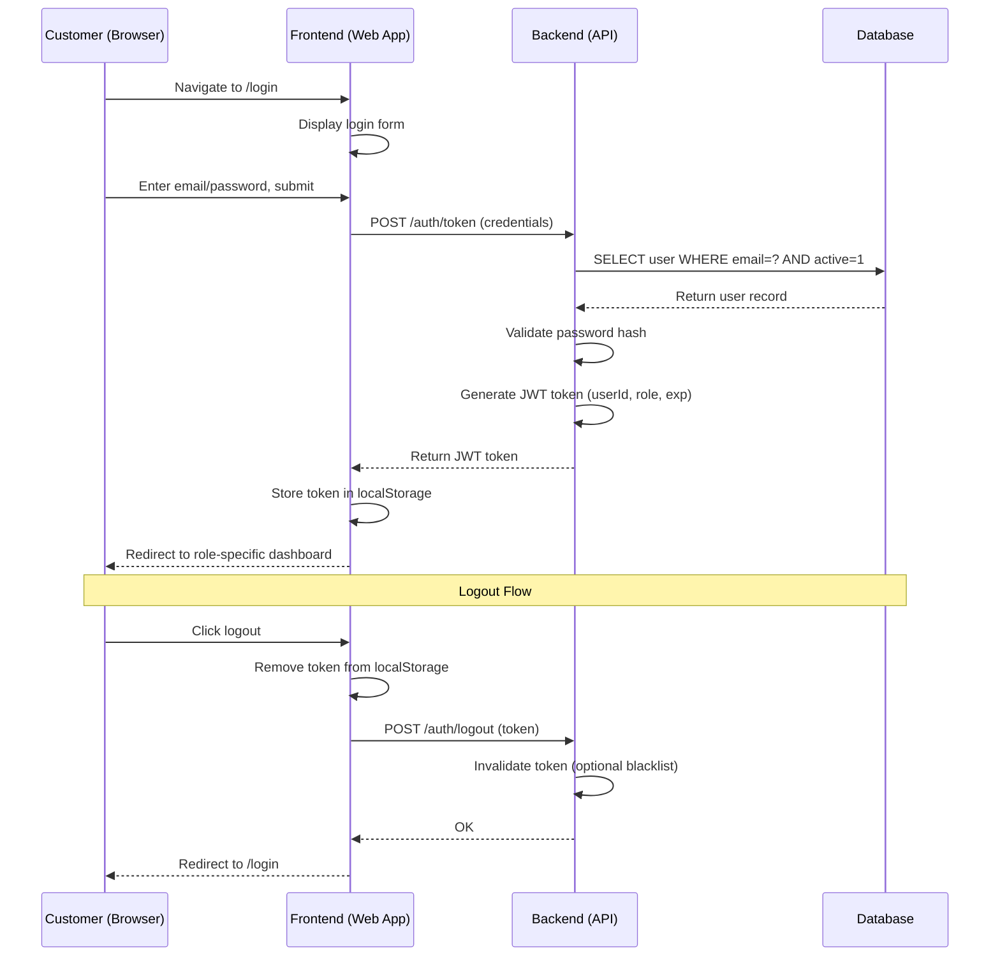
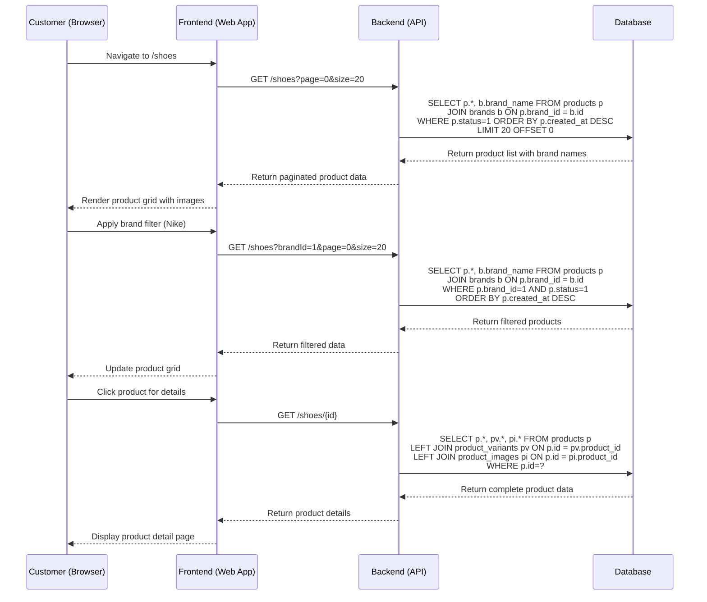
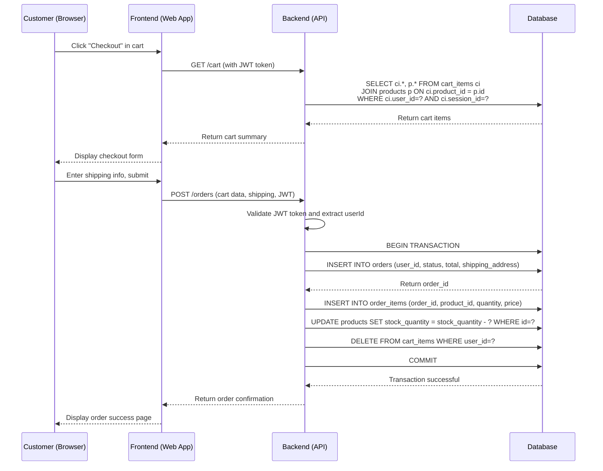
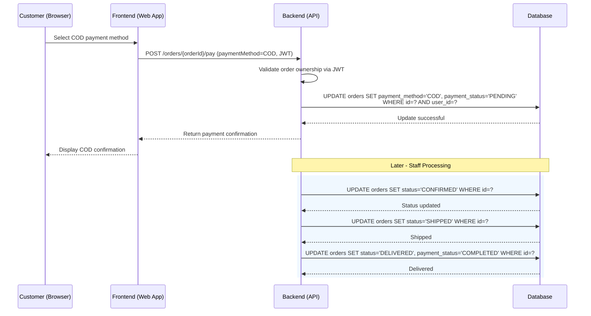
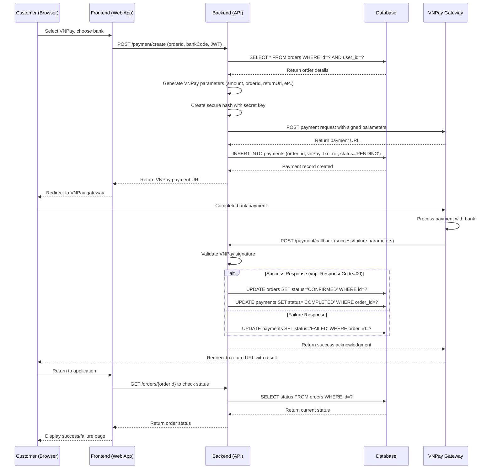
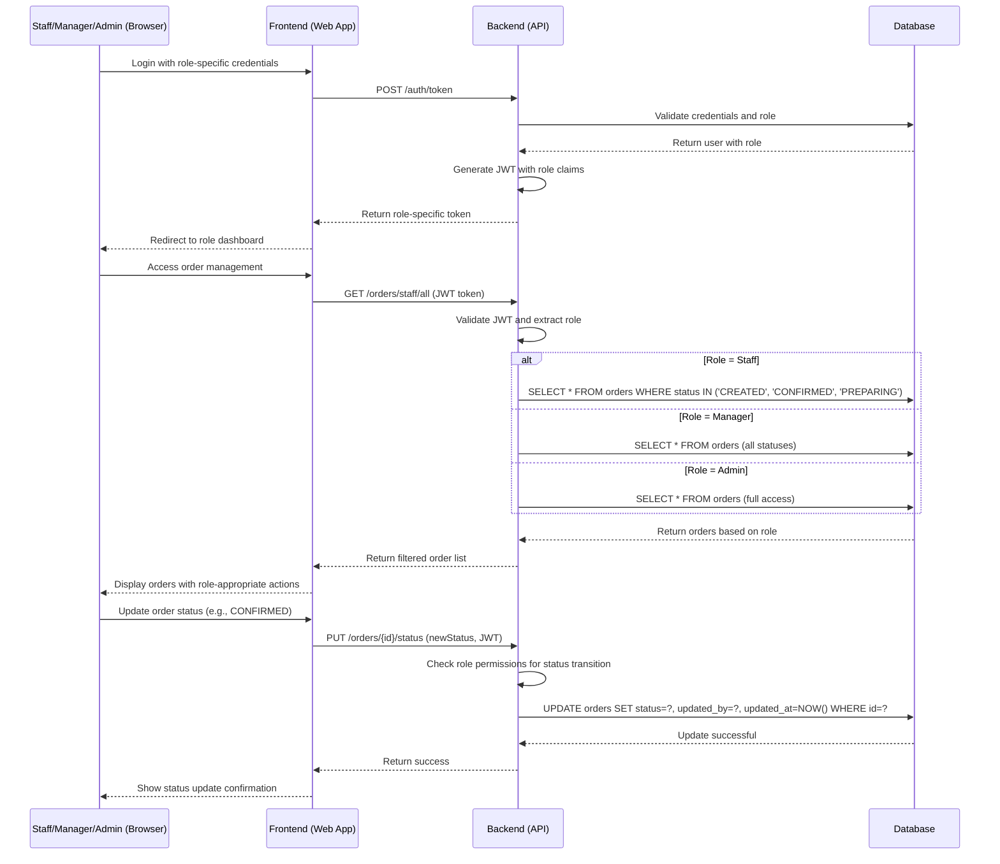

# Technical Workflows for ShoeShop Store

## 1. Login / Logout

The login/logout workflow involves frontend form submission, backend authentication service validation against the database, JWT token generation and validation, and session management. The system uses Spring Security for authentication, with user credentials stored encrypted in MySQL database. Logout invalidates the JWT token and clears client-side session data.



## 2. View Catalog

The catalog viewing workflow demonstrates frontend pagination requests, backend service layer filtering and sorting logic, and database queries with JOIN operations. The system implements lazy loading for performance, with product images served from cloud storage. Filtering uses indexed database columns for optimal query performance.



## 3. Order Checkout

The checkout workflow involves frontend form validation, backend order creation with transaction management, inventory reservation, and cart-to-order conversion. The system uses database transactions to ensure data consistency, with rollback capabilities for failed operations.



## 4. Payment (COD)

The COD payment workflow handles order status updates without external payment processing, focusing on inventory management and order lifecycle tracking. The system updates payment status and triggers order fulfillment processes.



## 5. Payment (VNPay)

The VNPay payment workflow demonstrates external payment gateway integration with secure redirects, callback processing, and signature validation. The system handles both success and failure scenarios with proper order status management.



## 6. Order Management (Staff/Manager/Admin)

The order management workflow shows role-based access control with different permission levels for staff, managers, and admins. The system enforces authorization at the API level while providing appropriate interfaces for each role.



## 7. Order Tracking (Customer)

The order tracking workflow demonstrates customer access to their order history with real-time status updates. The system provides personalized views while maintaining data security and performance.

```mermaid
sequenceDiagram
    participant C as Customer (Browser)
    participant FE as Frontend (Web App)
    participant BE as Backend (API)
    participant DB as Database

    C->>FE: Navigate to order history
    FE->>BE: GET /orders/user (JWT token)
    BE->>BE: Extract userId from JWT
    BE->>DB: SELECT o.*, oi.*, p.name FROM orders o<br>JOIN order_items oi ON o.id = oi.order_id<br>JOIN products p ON oi.product_id = p.id<br>WHERE o.user_id = ?<br>ORDER BY o.created_at DESC
    DB-->>BE: Return user's orders with items
    BE-->>FE: Return order history
    FE-->>C: Display order list with statuses
    C->>FE: Click specific order for details
    FE->>BE: GET /orders/{orderId}/user (JWT token)
    BE->>BE: Validate order ownership (userId matches)
    BE->>DB: SELECT o.*, oi.*, p.*, os.* FROM orders o<br>JOIN order_items oi ON o.id = oi.order_id<br>JOIN products p ON oi.product_id = p.id<br>LEFT JOIN order_status_history os ON o.id = os.order_id<br>WHERE o.id = ? AND o.user_id = ?
    DB-->>BE: Return detailed order info
    BE-->>FE: Return order details
    FE-->>C: Display complete order information
    Note over BE,DB: Status Update Notification
    rect rgb(240, 248, 255)
        BE->>DB: UPDATE orders SET status='SHIPPED' WHERE id=?
        DB-->>BE: Status updated
        BE->>BE: Send email notification to customer
        BE-->>C: Email: "Your order has shipped"
    end